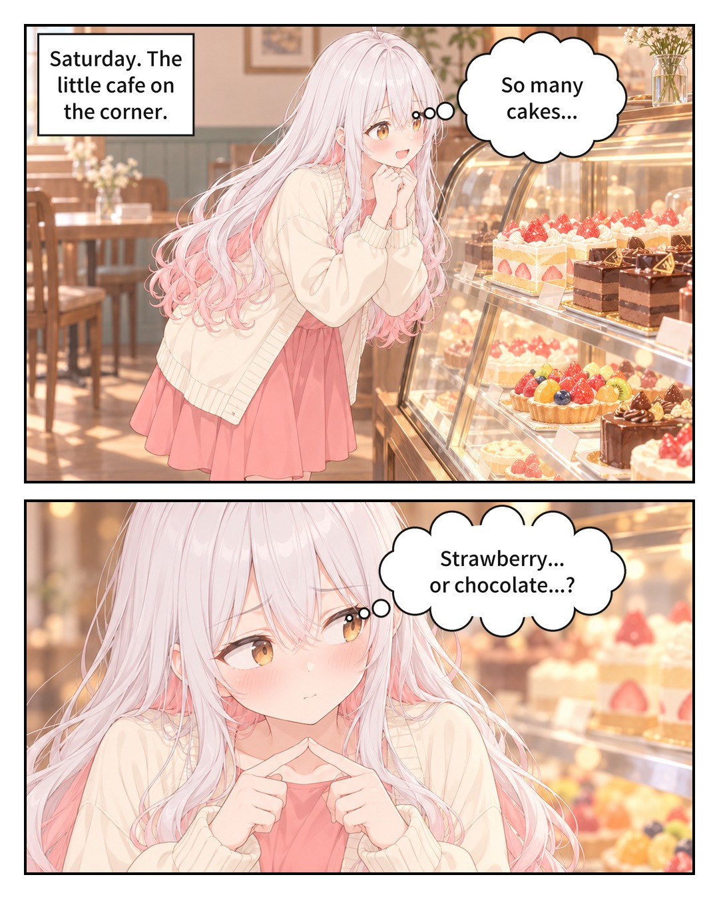
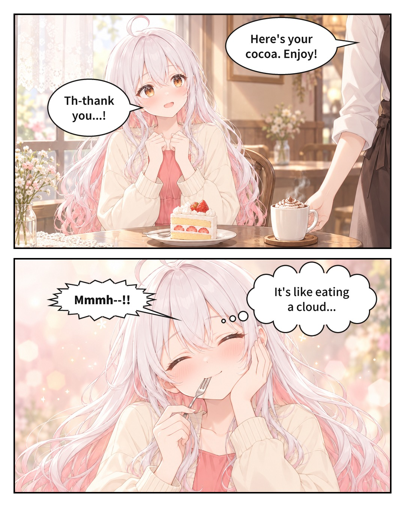
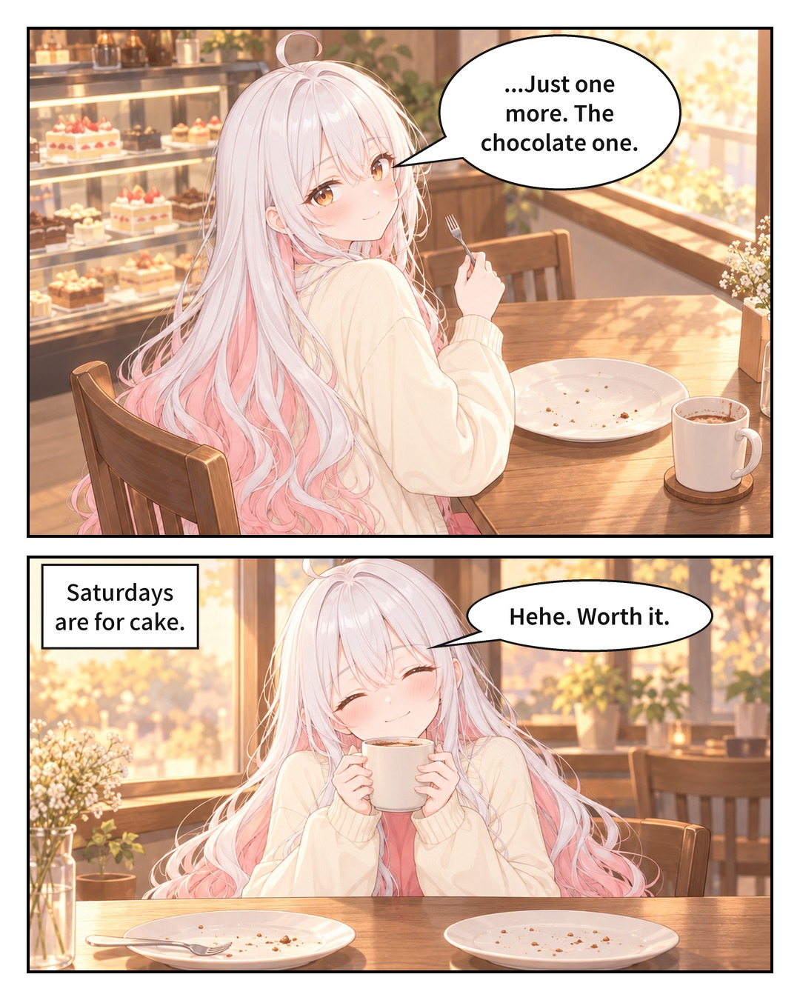

# agent-comic-kit

[English](README.md)

AI 에이전트와 함께 만화를 만듭니다. SNS 캐러셀 만화, 컷 만화(comic strip), 망가 또는 웹툰 스타일 페이지를 지원합니다. 사용자는 이야기와 캐릭터, 그리고 원하는 만큼의 연출 지시만 준비하면 됩니다. 인터뷰, 캐릭터 시트, 스토리보드, 페이지 생성, 컷 수정, 레터링, 내보내기는 에이전트가 이 저장소의 `comic` CLI로 진행합니다.

- **일관된 캐릭터.** 모든 캐릭터는 먼저 승인된 캐릭터 시트를 갖습니다. 시트는 설명문이나 직접 그린 스케치, 사진, 3D 스크린샷으로 만듭니다. 시트는 해당 캐릭터가 나오는 모든 페이지에 첨부됩니다.
- **연출 권한은 사용자에게.** 사용자가 지정한 내용(구도, 앵글, 표정)은 고정되어 그대로 지켜집니다. 지정하지 않은 부분은 에이전트가 연출합니다.
- **정확한 출력 형식.** 페이지는 목표 종횡비로 생성한 뒤 컷 단위로 분할합니다. 망가진 컷은 그 컷만 다시 그리고, 결과는 정확한 캔버스에 배치합니다(Instagram 4:5, X, 세로 스크롤 등의 프리셋은 수정할 수 있는 예시입니다).
- **진짜 레터링.** 말풍선, 외침, 생각, 내레이션 상자는 이미지 모델이 아니라 도구가 그립니다. 그래서 오타가 없고, 이미지를 다시 생성하지 않고도 텍스트를 수정하거나 번역할 수 있습니다.

> Keywords: comic, manga, webtoon, manhwa, comic strip, AI comic generator, Claude Code skill, Codex, GPT Image.

---

## For AI agents

사용자가 이 저장소 URL을 주었다면 다음 순서로 진행합니다.

1. **이미지 백엔드를 확인합니다.** 기본 백엔드는 [codex-image-relay](https://github.com/Saeyeon-developer/codex-image-relay)를 사용합니다(Windows + Codex 데스크톱 앱, 로그인 상태). 이것도 함께 설치하고, 프로젝트의 `comic.yaml`에 있는 `backend.relay`(또는 환경 변수 `COMIC_RELAY`)를 그 `imagen.ps1`로 지정합니다. 자체 GPT Image 도구가 있다면(예: Codex 안에서) 대신 `backend.name: agent`를 사용합니다. 둘 다 불가능하면 중단하고 사용자에게 알립니다.
2. **스킬로 설치합니다.** 예를 들어 Claude Code에서는 다음과 같이 합니다.
   ```bash
   git clone https://github.com/Saeyeon-developer/agent-comic-kit ~/.claude/skills/agent-comic-kit
   pip install pillow pyyaml
   ```
3. **[`SKILL.md`](SKILL.md)를 읽습니다.** 전체 워크플로가 담겨 있습니다. 인터뷰 → 캐스트 → 스토리보드 → 페이지 → 검토 → 레터링 → 내보내기 순서이고, 검토 체크리스트와 사용자의 연출 지시에 관한 규칙도 있습니다.
4. **연출과 검토에는 성능이 높은 비전 모델을 사용합니다.** 이미지 한 장마다 사용자의 요금제 할당량이 소모됩니다. 다음 단계에 필요한 이미지만 생성하세요. 같은 수정을 세 번째로 다시 시도하기 전에는 사용자에게 먼저 물어보세요.

---

## Requirements

- Pillow와 PyYAML이 설치된 Python 3.11 이상
- 이미지 백엔드: [codex-image-relay](https://github.com/Saeyeon-developer/codex-image-relay)(Windows, Codex 데스크톱 앱) 또는 자체 GPT Image 도구가 있는 에이전트(`agent` 백엔드)
- 대사 언어에 맞는 폰트. Noto Sans CJK / Noto Sans KR/JP/SC가 설치되어 있으면 자동으로 찾습니다. 없으면 `lettering.font`를 지정하세요.
- 선택: 프롬프트 작성을 위한 [gpt-image-25](https://github.com/Saeyeon-developer/AI-video-prompt-skill/tree/main/gpt-image-25) 스킬

## Quick start

```bash
python -m comic init my-comic --title "Crepe Day" --preset instagram-carousel
python -m comic cast new my-comic alice --name "Alice"
#   edit my-comic/comic.yaml and my-comic/cast/alice/character.yaml
python -m comic gen sheet my-comic alice
python -m comic cast approve my-comic alice
#   write my-comic/episodes/ep01/script.yaml (see templates/script.yaml)
python -m comic gen page my-comic ep01 p01
python -m comic split my-comic ep01 p01
python -m comic compose my-comic ep01 p01
python -m comic letter my-comic ep01 p01
python -m comic export my-comic ep01      # → episodes/ep01/out/ + preview.html
```

실제로는 에이전트에게 말하면 에이전트가 이 명령을 실행합니다. 전체 워크플로와 명령어 레퍼런스는 [`SKILL.md`](SKILL.md)를 참고하세요.

## How a page is made

```
script.yaml ─► prompt page ─► gen page ─► split ─► review each panel ─► (redraw a panel at its slot ratio ─► use)
                                                        │
                                                        ▼
                                  export ◄── letter (check, adjust) ◄── compose (exact canvas)
```

1. 페이지 프롬프트는 프로젝트 정보로 조립합니다. 정확한 종횡비, 각 참조 시트의 역할, 캐릭터별 고정 외형 설명과 키 관계, 컷 레이아웃, 컷별 블록 하나씩, 스타일, 그리고 "텍스트 없음"이 들어갑니다.
2. 생성된 페이지는 흰색 거터를 감지해서 컷 단위로 분할합니다.
3. 에이전트가 스토리보드와 시트에 비추어 컷을 하나씩 검토합니다. 잘못된 컷은 그 컷만 슬롯의 정확한 비율로 다시 그립니다. 이때 페이지를 스타일 참조로 사용합니다.
4. 컷은 정확한 출력 캔버스에 균일한 여백, 거터, 테두리로 배치됩니다.
5. 에이전트가 모든 컷에서 각 얼굴의 위치를 기록합니다. 그러면 말풍선이 얼굴을 피해 자동으로 배치되고, 꼬리는 말하는 인물을 향합니다. 에이전트가 이를 확인하고, 필요하면 `lettering.yaml`(컷 기준 상대 위치)에서 조정합니다.

## Output formats

프리셋은 [`presets/formats/`](presets/formats)에 있습니다. 프리셋은 **예시**일 뿐이며, 만화나 망가, 웹툰이 "무엇인가"를 규정하는 규칙이 아닙니다. 하나를 복사해서 사용하는 플랫폼에 맞게 숫자를 바꾸세요.

| Preset | Kind | Canvas | Notes |
|---|---|---|---|
| `instagram-carousel` | slides | 1080×1350 (4:5) | 최대 20장 |
| `instagram-carousel-34` | slides | 1080×1440 (3:4) | |
| `x-post` | slides | 1080×1350 (4:5) | 게시물당 이미지 4장, 긴 에피소드는 여러 게시물로 분할 |
| `vertical-scroll` | scroll | 800 wide | 이어 붙인 뒤 잘라냄 |

값은 2026-10에 확인했습니다. 플랫폼은 규칙을 바꾸므로 의존하기 전에 다시 확인하세요.

## Example: "Saturday Cake"

이 툴로 처음부터 끝까지 만든 3장짜리 인스타그램 캐러셀입니다. 오너가 확정한 캐릭터 시트 한 장만 레퍼런스로 쓰고, 영어 콘티 작성 → 4:5 페이지 3장 생성 → 컷 분리 → 재배치 → 얼굴 위치 기반 자동 식자(말풍선 10개 중 1개만 수동 조정) 순서로 만들었습니다.

<p>
  
  
  
</p>

<sub>Lumi는 Saeyeon-developer가 저작권을 가진 오리지널 캐릭터입니다. 예시 이미지는 시연용으로만 게시하며 이 저장소의 Apache-2.0 라이선스 적용 대상이 **아닙니다**. 허락 없이 이미지나 캐릭터를 재사용하지 마세요.</sub>

## Status

v0.1입니다. 3D 스크린샷으로 만든 캐릭터 시트, 컷 단독 재생성, 위 예시를 포함해 실제 에피소드로 전체 파이프라인을 처음부터 끝까지 실행했습니다.

## Limits

- 이미지 생성 품질과 일관성은 이미지 모델에 달려 있습니다. 검토는 워크플로의 일부이며 생략할 수 없습니다.
- v0.1은 컷을 가로 행으로 쌓아서(전체 너비, 위에서 아래로) 배치합니다. 그리드 레이아웃은 계획 중입니다.
- 기본 백엔드는 Windows 전용입니다(Codex 데스크톱 앱에 의존합니다).

## Roadmap

- 말풍선 위치, 컷 교체, 페이지 순서를 편집하는 로컬 웹 에디터
- 더 많은 이미지 백엔드(Gemini / Nano Banana, NovelAI 등)
- 그리드 컷 레이아웃, 더 많은 프리셋(웹툰 플랫폼, Threads 등)

## License

[Apache License 2.0](LICENSE)
